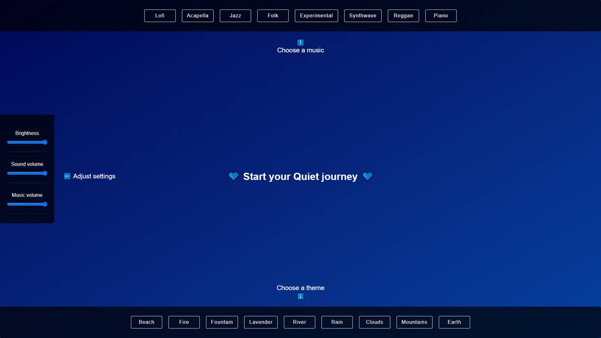

# Quiet • Clear your mind

## 💙 Start your Quiet journey 💙

 

-- Inspired by calm

 

## What about it?

This is a web application (currently desktop only) to take a break and relax in the browser.
The idea is that you can select two options : music and theme.

Then, the landscape appears and the music starts playing. You can watch the video, listen to the sounds, listen to the music, listen to both or mute everything and just watch the landscape if you want... You can adjust the settings just like you want!

 

## Preview

 

 

## Features

 

### On the top bar you can choose a music

### On the left side you can adjust the settings

### On the bottom bar you can choose the theme

 

 

## Philosophy

- Keep it stupid simple
- No library

 

## Stack

- HTML / CSS
- Vanilla JavaScript

 

Feel free to fork the project and add features.
